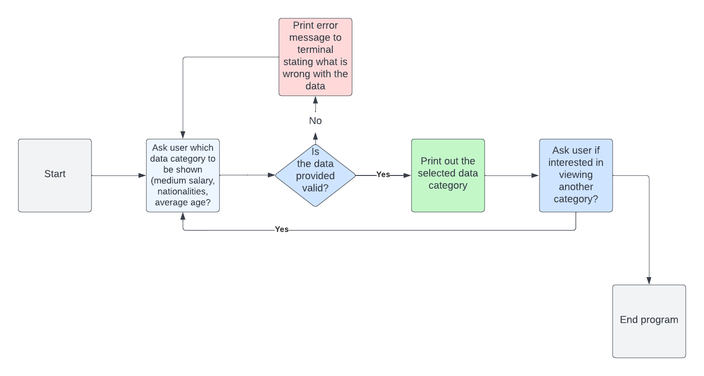
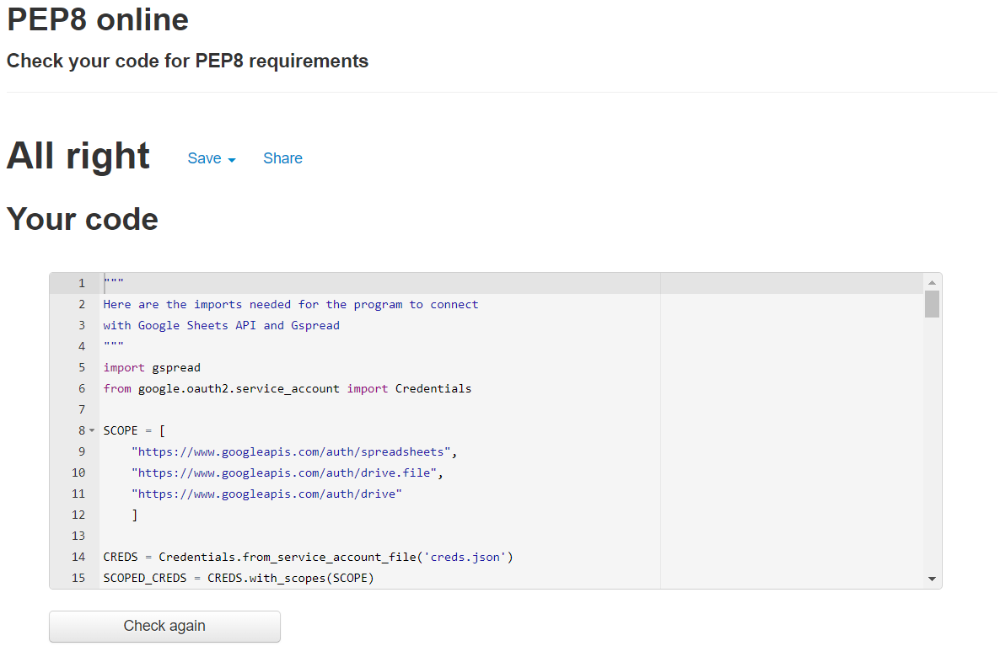
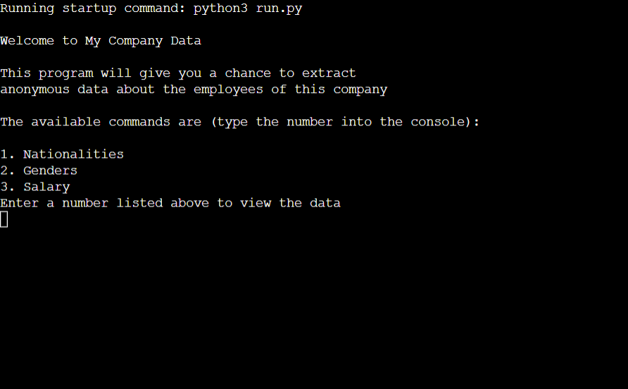
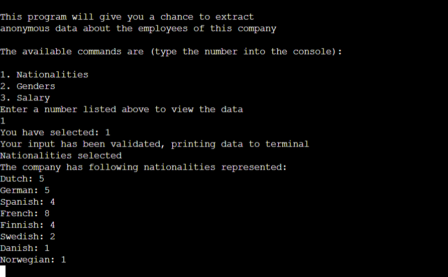
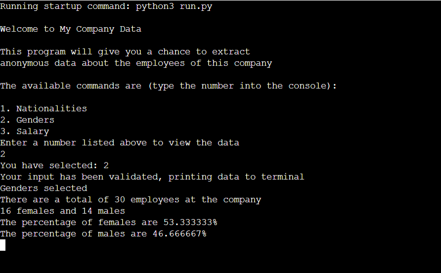
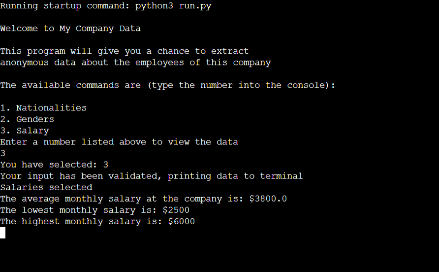

# My Company Data

## Purpose of the project
<hr>

The purpose of the project is to give the user an insight to employee data regarding Employer ID, Full name, age, nationality as well as the ability to see the average salary and gender difference within the company. Full name and Employer ID will not be made visible to the user because the information should stay anonymous.

## User stories
<hr>

- As a user I would like to know what kind of input is required.
- As a user I would like to know what options of information are available before I type it in the console.
- As a user I would like to continue the program after an error has occurred.
- As a user I would like to know what kind of Error has occured and what I need to change in my input to get the correct output.

## Features
<hr>

### Welcome Screen
- The welcome message is displayed once all the functions have loaded.

### First data category: Nationalities
- If the user enters "1" in the terminal, this data will be printed to the terminal.

### Second data category: Genders
- If the user enters "2" in the terminal, this data will be printed to the terminal.

### Third data category: Salary
- If the user enters "3" in the terminal, this data will be printed to the terminal

## Future Features
<hr>

I would like to add GUI to the application with charts of the data.

## Lucid Chart
<hr>



## Technology
<hr>

### _lucid.app_
- I used Lucid App for making my lucid chart.

### _GitHub_
 - GitHub is where the code is stored and the site was hosted.

### _GitPod_
- GitPod is the developer environment in the cloud.

### _Google Cloud Platform_
- This is where I get the API keys to be able to communicate between the app and Google Sheets as well as Google Drive

### _Heroku_
- Heroku is the environment where the app will be able to run with a terminal

## Testing
<hr>

### _Code validation_
- Code validator / PEP8


   - Passed without any faults

### _Test cases - Welcome Screen_

- The welcome message is displayed once all the functions have loaded.

### _Test cases - First data category: Nationalities_

- If the user enters "1" in the terminal, this data will be printed to the terminal.

### _Test cases - Second data category: Genders_

- If the user enters "2" in the terminal, this data will be printed to the terminal.

### _Test cases - Third data category: Salary_

- If the user enters "3" in the terminal, this data will be printed to the terminal

### _Fixed bugs_
- Fixed bug where I used a while loop that ran indefinitely.
- Fixed bug that didn't validate the user input. It didn't give an error but always printed out "Your input has been validated, printing data to terminal" to the terminal regardless of if the input was 1, 2 or 3 or even the word 'cat'.
- Fixed bug that 


## Deployment
<hr>

### _via GitPod_
- GitPod was used as the environment for development. These are the steps to set it up:
  - I used Code Institute Python Essentials template (https://github.com/Code-Institute-Org/python-essentials-template)
  - Click Use this template.
  - GitPod will now set up the environment for you with all addons/shortcuts needed.'

### _via Heroku_
- Heroku provides the interface to be able to run python programs. This is how I set it up:
   - I log on to my account at [Heroku](https://dashboard.heroku.com/apps), then up on the right hand side there's a button that says New -> Create new app.
   - I named the project and selected Europe since that's where I'm located.
   - Then I navigate to the newly created app and select Settings.
   - Once in there I have to add my API credentials.
      - Find section called Config Vars and add a new one. in Keys I added 'CREDS' and then in Value I added the confidential information. Click Save.
   - Next thing to do in Settings section is to use Buildpacks. Add both Python and NodeJS, one at a time and click Save.
      - Make sure Python is the top one. If it is not you can drag and drop it at the top.
   - Then go to Deploy section and select GitHub and then log in with your GitHub account.
   - Remember to push your code every once in a while to Heroku.

## Credits
<hr>

### _Code_
- I would like to thank my mentor Rohit for providing me with refactoring my code as well as this nugget:
```
if __name__ == '__main__':
    main()
```
- I would also like to thank [W3Schools](https://www.w3schools.com/) that I used frequently to refresh my memory with methods, functions and other tips.
- Another useful help was the Love Sandwiches Walkthrough project by [Code Institute](https://www.codeinstitute.net/)

### _Templates_
- Thank you to [Code Institute](https://www.codeinstitute.net/) for supplying me with the [GitPod Template](https://github.com/Code-Institute-Org/python-essentials-template)