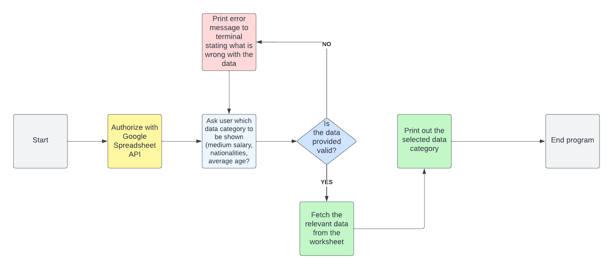

# My Company Data

## Purpose of the project
The purpose of the project is to give the user an insight to employee data regarding Employer ID, Full name, age, nationality as well as the ability to see the average salary and gender difference within the company. Full name and Employer ID will not be made visible to the user because the information should stay anonymous.

## User stories
- As a user I would like to know what kind of input is required.
- As a user I would like to know what options of information are available before I type it in the console.
- As a user I would like to continue the program after an error has occurred.
- As a user I would like to know what kind of Error has occured and what I need to change in my input to get the correct output.

## Features
- 

## Future Features
- I would like to add GUI to the application with charts of the data.

## Lucid Chart

## Technology
- 

## Testing
   - 8.1 code validation / Python validator
   - 8.2 test cases (user story based with screenshots) / describe the steps I have taken to test
   - 8.3 fixed bugs

## Deployment
   - 9.1 via gitpod
   - 9.2 via Heroku

## Credits